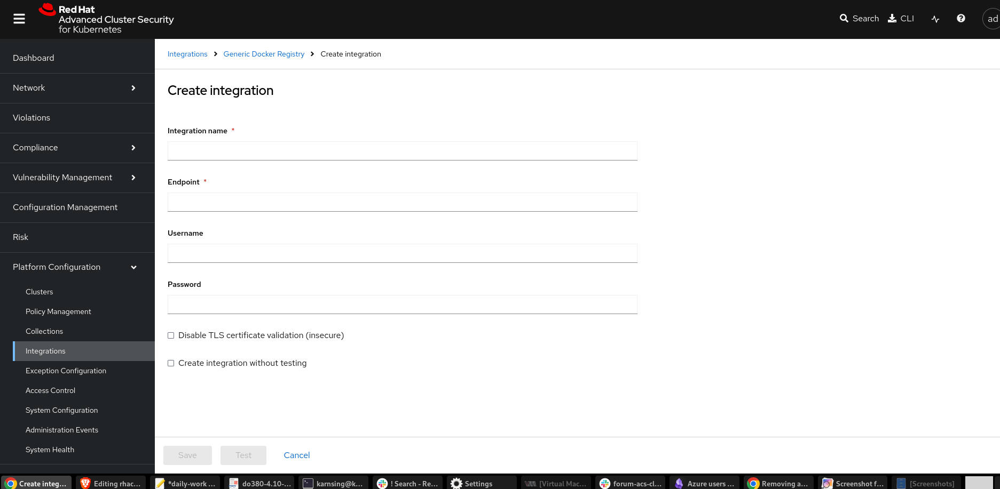

# rhacs-ocp-internal-registry-integration

1. Install RHACS operator from the OCP console.
2. After installing the operator create `central`. If there are less resources on the cluster then you can add following in the configuration of central. You can add below before or after creaing the central.

```bash
spec:
  central:
    db:
      isEnabled: Default
      persistence:
        persistentVolumeClaim:
          claimName: central-db
      resources:
        limits:
          cpu: '1'
          memory: 1Gi
        requests:
          cpu: 250m
          memory: 1Gi
```
3. Verify that add central pods are running.
```bash
oc get pods -n rhacs-operator
NAME                                                READY   STATUS    RESTARTS      AGE
central-855476649d-m4f2l                            1/1     Running   4 (16h ago)   17h
central-db-6c95fb4d67-gdbg8                         1/1     Running   0             16h
rhacs-operator-controller-manager-cddd5947f-f7js6   1/1     Running   0             18h
scanner-55c8874bdd-fgclv                            1/1     Running   0             17h
scanner-55c8874bdd-j9rgk                            1/1     Running   0             17h
scanner-db-5c99759dc7-mrq9t                         1/1     Running   0             17h
```
4. Get the central route and try to access in the browser.
```bash
oc get route -n rhacs-operator
NAME           HOST/PORT                                                    PATH   SERVICES   PORT    TERMINATION   WILDCARD
central        central-rhacs-operator.apps.url.com          central    https   passthrough   None
central-mtls   central.rhacs-operator                                              central    https   passthrough   None
```
5. Central creates `admin` to access the Central WebUI, password for admin user can be fetched with below command.

```bash
oc get secret central-htpasswd -n rhacs-operator
oc -n rhacs-operator get secret central-htpasswd -o go-template='{{index .data "password" | base64decode}}'
```

6. To create the registry integration in central, verify if default registry route exists.
```bash
oc get route -n openshift-image-registry
No resources found in openshift-image-registry namespace.
```
7. As the route does not exist so lets create it and copy the route to add in registry.

```bash
oc patch configs.imageregistry.operator.openshift.io/cluster --patch '{"spec":{"defaultRoute":true}}' --type=merge
$ oc get route -n openshift-image-registry
NAME            HOST/PORT                                                 PATH   SERVICES         PORT    TERMINATION   WILDCARD
default-route   default-route-openshift-image-registry.apps-crc.testing          image-registry   <all>   reencrypt     None
e
```
8. Access the Console and go to `Platform Configuration >> Integration >> Generic Docker Registry`

9. Click on `New Integration >> Provide your cluster registry endpoint, username and password`


10. Now configure the registry configuration in central with `route` fetched in 7th step, `admin user`, and `password` fetched from 5th step. Keep the `TLS` Certificate Validation disabled.


11. Create a service account to use with central in a namespace from where you want to scan the images and add the `image-puller` role to the SA.
```bash
oc new-project scan
oc create sa rhacs-scanner-sa -n scan
oc policy add-role-to-user system:image-puller system:serviceaccount:scan:rhacs-scanner-sa -n scan
```
12. Get the SA token and copy it.
```bash
oc create token rhacs-scanner-sa -n scan
eyJhbGciOiJSUzI1NiIsImtpZCI6IkhtSHRmSm5Lbk5KYjZlRUt
```
13. Download the roxctl

```bash
arch="$(uname -m | sed "s/x86_64//")"; arch="${arch:+-$arch}"
curl -f -o roxctl "https://mirror.openshift.com/pub/rhacs/assets/4.5.0/bin/Linux/roxctl${arch}"
sudo cp roxctl /usr/bin
sudo chmod +x /usr/bin/roxctl
roxctl version
roxctl central whoami
```
14. Configure roxctl to use Central Endpoint and API_TOKEN. Api token can be fetched from `Central UI >> Platform Configuration >> Integration >> API Token >> Generate Token`

```bash
export ROX_ENDPOINT="central-rhacs-operator.apps.url.com"
export ROX_API_TOKEN="eyJhbGciOiJSUzI1NiIsImtpZCI6Imp3dGs"
```
15. Login to Central
```bash
roxctl central login
roxctl central login --insecure
roxctl central whoami
```

16. If it is still not logged in then run following command to login and run whoami to see if we are logged in.
```bash
roxctl config set-central $ROX_ENDPOINT --token $ROX_API_TOKEN --insecure
roxctl central whoami
```
17. Now scan the images, ensure you have an image in the `scan` project for which created the Service Account. Specify the same image for scanning with roxctl
```bash

oc get is -n scan
NAME    IMAGE REPOSITORY                                                                        TAGS     UPDATED
nginx   default-route-openshift-image-registry.apps.url.com/scan/nginx   latest   16 hours ago

roxctl image scan --force --image=image-registry.openshift-image-registry.svc:5000/scan/nginx:latest
roxctl image scan --force --image=image-registry.openshift-image-registry.svc:5000/scan/nginx:latest  --insecure-skip-tls-verify
{
  "id": "sha256:536ab068ad29a3404462cfaa078d398b2e47bb10942835a6e7d78acecaa36701",
  "name": {
    "registry": "image-registry.openshift-image-registry.svc:5000",
    "remote": "scan/nginx",
    "tag": "latest",
    "fullName": "image-registry.openshift-image-registry.svc:5000/scan/nginx:latest"
  },
  "names": [
    {
      "registry": "image-registry.openshift-image-registry.svc:5000",
      "remote": "scan/nginx",
      "tag": "latest",
      "fullName": "image-registry.openshift-image-registry.svc:5000/scan/nginx:latest"
    }
  ],

```
